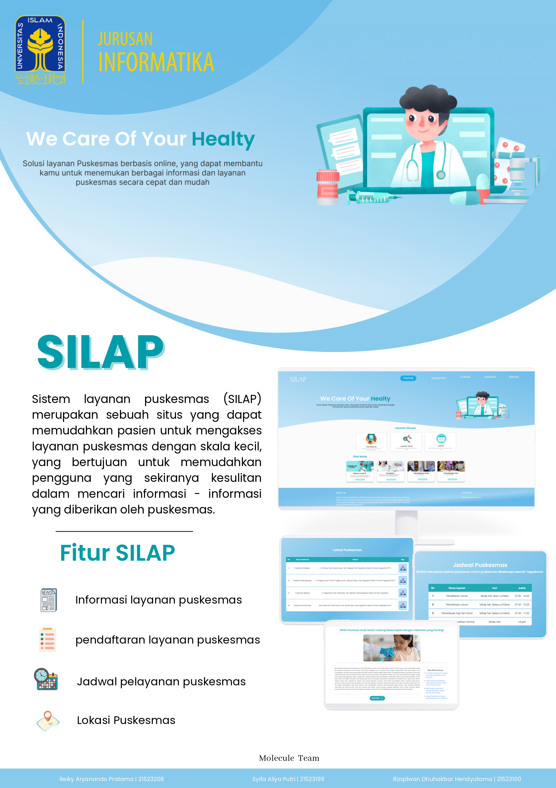
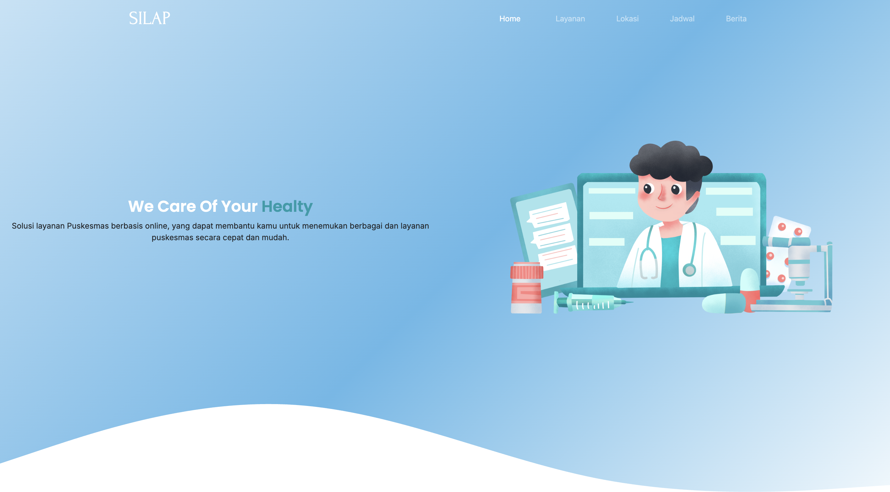
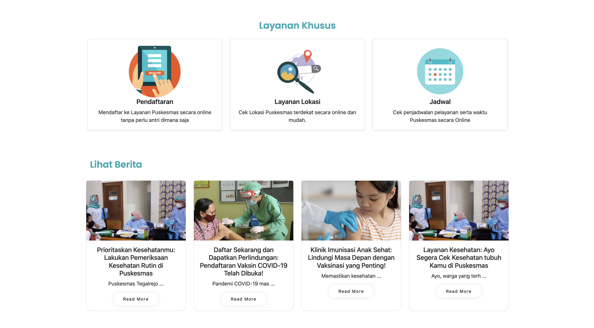
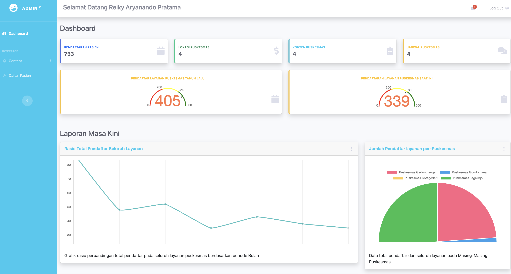
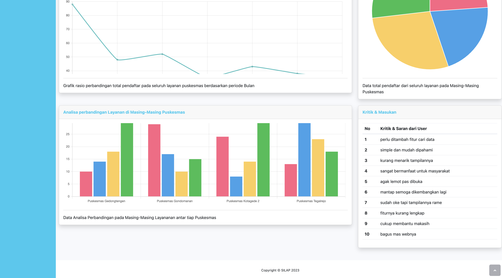

# 🏥 SILAP  
*Sistem Informasi Layanan Puskesmas (Web-based Application)*  
*Tugas Besar Pengembangan Sistem Informasi UII FTI 2023*



---

## 📖 Deskripsi  
**SILAP** adalah sistem informasi berbasis web yang dirancang untuk memudahkan masyarakat dalam mengakses layanan informasi puskesmas skala kecil.  
Sebelumnya, informasi puskesmas hanya bisa diperoleh secara manual melalui brosur atau datang langsung ke lokasi. Dengan adanya SILAP, pengguna dapat memperoleh informasi layanan dengan lebih cepat, mudah, dan efisien.  

Aplikasi ini juga dilengkapi dengan **fitur manajemen data dan visualisasi grafik** yang membantu administrator dan manager dalam mengambil keputusan berbasis data.  

---

## ✨ Fitur Utama  
- 📋 **Informasi Layanan Puskesmas**  
- 📝 **Pendaftaran Layanan Online**  
- 📍 **Pencarian Lokasi Puskesmas Terdekat**  
- 🕒 **Jadwal Pelayanan Puskesmas**  
- 📊 **Dashboard Statistik & Grafik** (Line Chart, Pie Chart, dsb.)  
- 👥 **Hak Akses Berbeda**  
  - **Pengunjung** → akses informasi & pendaftaran layanan  
  - **Administrator** → kelola data puskesmas & pengguna  
  - **Manager** → memantau data, laporan, serta grafik statistik  

---

## 🛠️ Teknologi yang Digunakan  
- **HTML5 / CSS3 / Bootstrap** (Frontend)  
- **PHP Native** (Backend)  
- **MySQL + phpMyAdmin** (Database)  
- **Chart.js** (Visualisasi Data)  
- **XAMPP / MAMP** (Local Server)  

---

## 📸 Tampilan Aplikasi  

### Role: User
| Home Page |
|-----------|
|  |
 | 

### Role: Admin
| Dashboard |
|-----------|
|  |
 | 

---

## 🚀 Instalasi & Menjalankan Projek  

1. **Download / Clone** repository ini.  
   ```bash
   git clone https://github.com/reiky03/Silap_Website.git
2. Aktifkan server lokal menggunakan XAMPP (Windows/Linux) atau MAMP (Mac).
3. Pindahkan folder projek ke dalam direktori htdocs.
   ```bash
   /xampp/htdocs/silap   (untuk XAMPP)
   /Applications/MAMP/htdocs/silap   (untuk MAMP)
4. Import database:
  - Buka phpMyAdmin.
  - Buat database baru (misalnya silap_db).
  - Import file SQL dari folder /silap_dbb.sql.
5. Akses aplikasi melalui browser:
  ```bash
  http://localhost/silap
